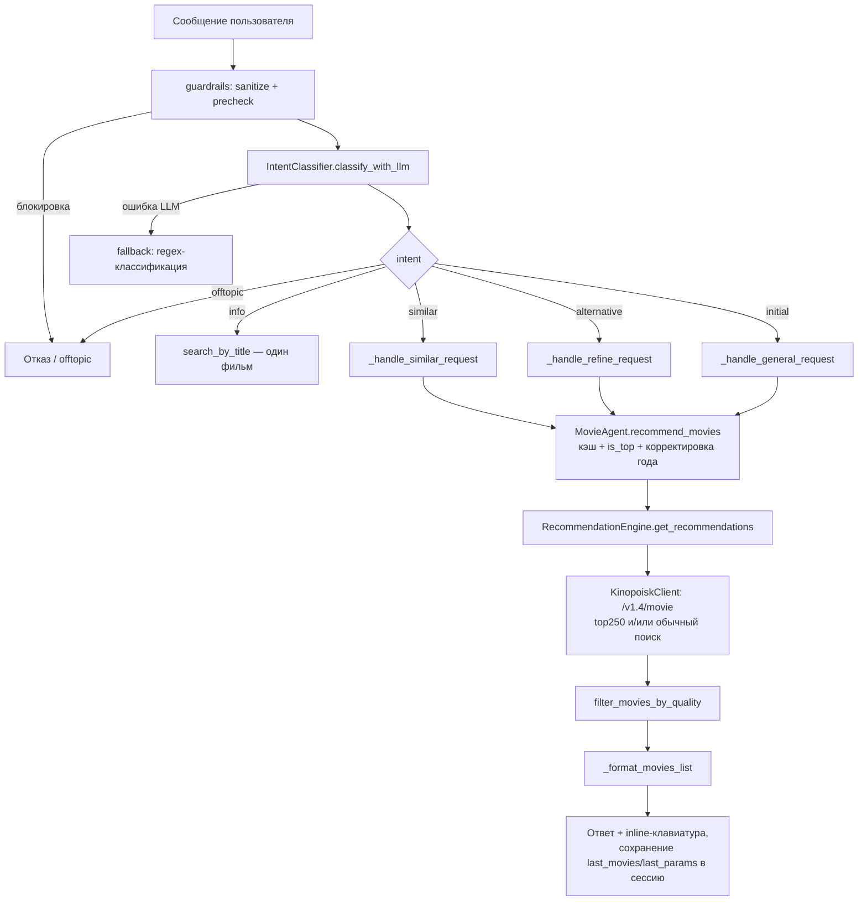

# Алгоритм рекомендаций фильмов (текущее состояние)

Документ описывает фактическую реализацию рекомендательного контура:
от сообщения пользователя до готового списка фильмов. Все ссылки — на
исходники в `src/`.

## 1. Общая схема

Ключевые файлы:

| Слой | Файл |
|---|---|
| Оркестрация диалога | `src/dialogue_manager.py` |
| Классификация интентов / извлечение параметров | `src/intent_classifier.py`, `src/prompts/parameter_extraction_prompt.txt`, `src/guardrails.py` |
| Агент (кэш, is_top) | `src/movie_agent.py` |
| Движок рекомендаций | `src/recommendation_engine.py` |
| Клиент Kinopoisk API | `src/kinopoisk_client.py` |
| Фильтры качества и жанров | `src/utils/movie_filter.py` |
| Конфиг | `src/config.py` |

## 2. Классификация запроса и извлечение параметров

1. Сообщение санитизируется и проходит `precheck_message` (`guardrails.py`) —
   досудебное отсечение офтопика и prompt-injection без LLM.
2. Основной путь — LLM (`IntentClassifier.classify_with_llm`): системный
   промпт `parameter_extraction_prompt.txt`, пользовательский запрос
   обёрнут в теги `<user_query>` + «сэндвич»-напоминание после данных.
   Ответ — строго JSON с полями:
   `intent, target_movie, genre, year, year_range, actor, director,
   studio, country, mood, count, min_rating, movie_type`.
3. JSON извлекается regex, затем `validate_classifier_output`:
   неизвестный интент → `offtopic`; `movie_type` → только `movie`/`tv-series`;
   `count`/`year` → int, `min_rating` → float, невалидное → None.
4. Fallback без LLM (`_classify_fallback`) — regex/ключевые слова:
   диапазоны лет `2024-2025`, десятилетия («90-х», «нулевых»),
   «топ N» → count, страны, жанры, «сериал» → tv-series,
   «топ/лучш/рейтинг» → min_rating=7.0, «расскажи/сюжет» → intent=info.

Интенты: `initial` (новый поиск), `info` (о конкретном фильме),
`similar` (похожие на предыдущие), `alternative` (другие варианты
по тем же параметрам), `offtopic` (отказ).

## 3. Обработчики интентов (dialogue_manager.py)

### initial — `_handle_general_request`

- **Настроение**: если в сообщении есть триггерные фразы
  («грустн», «устал», «скучно», «адреналин» и т.д.) и жанр не указан
  явно, берётся список жанров из `mood_to_genre` (напр., «грустн» →
  комедия, мультфильм, мюзикл, ромком) и поиск идёт **по очереди по
  каждому жанру** до набора `limit` уникальных фильмов.
- Явный жанр из LLM всегда переопределяет настроение.
- **Десятилетия**: `year=2000` (кратен 10, 1900–2020) превращается в
  `year_range=(2000, min(2009, CURRENT_YEAR))`.
- `min_rating`: из параметров LLM, иначе 6.5 для десятилетия и 6.0 по умолчанию.
- `limit`: `count` из запроса («топ 5»), иначе 13.
- `query`: имя актёра, либо весь текст сообщения, если он короткий (≤5 слов)
  и нет жанра/настроения — тогда Кинопоиск ищет полнотекстово.
- Пустой результат → сообщение об ошибке с перечислением критериев.

### info — `_handle_info_request`

`MovieAgent.search_by_title` → `/v1.4/movie/search`, только `type=movie`,
точное совпадение по `name`/`alternativeName`, иначе первый кандидат.
Возвращается один фильм с описанием (≤500 символов).

### similar — `_handle_similar_request`

Требует `session.last_movies` (иначе — просьба сначала найти фильм).

- `movie_type` — по типу последнего фильма.
- `country` — из нового запроса, иначе из сессии.
- **Жанр**: у одного фильма — первый жанр; у списка — доминирующий
  жанр через `Counter.most_common(1)`.
- **Диапазон лет**:
  - явный `year_range` → как есть;
  - явный `year`: десятилетие → (Y, Y+9); конкретный год → (Y-3, Y+3);
  - иначе из последнего фильма: год ±3; для списка — (min-2, max+2).
- **min_rating**: `max(6.0, рейтинг - 0.5)`, где рейтинг — у одного
  фильма imdb/kp, у списка — медиана.
- Поиск с `limit=25`, затем отсеиваются уже показанные ID, берётся 13
  (если новых нет — повторяются старые).

### alternative — `_handle_refine_request`

Требует `session.last_params`. По тем же параметрам (жанр/год/актёр/
режиссёр/страна, `min_rating` из сессии или 6.0) перебираются
`mood_genres` (или один жанр, по умолчанию «комедия»), `limit=30` на
жанр, собираются до 13 фильмов, не показанных ранее. Если новых нет —
повтор предыдущей выдачи с заголовком «Повторяю предыдущие рекомендации».

После любого ответа `_update_session` сохраняет `last_movies` и
`last_params` в in-memory сессию (`session_manager.py`).

## 4. MovieAgent (movie_agent.py)

- **Кэш**: in-memory `dict`, ключ — `user_id + все параметры поиска`,
  TTL — `CACHE_TTL` (по умолчанию 45 с, из `.env`). Кэшируются только
  непустые результаты. Кэш не переживает рестарт и не делится между
  воркерами. `clear_cache(user_id)` чистит по префиксу ключа.
- `year_range` обрезается сверху текущим годом (`CURRENT_YEAR` из
  `config.py` = `date.today().year` — единый источник для проекта).
- **is_top**: определяется по словам «топ/лучш/рейтинг/best/top» в
  исходном `query` — включает дополнительную выборку из топ-250.
- Любое исключение → пустой список (бот не падает).

## 5. RecommendationEngine (recommendation_engine.py)

### Подготовка

- `is_russian_search` — страна запроса «россия/russia/российская федерация».
- **allowed_excluded_genres** — жанры из чёрного списка, разрешённые
  потому, что пользователь запросил их явно:
  - `genre_name` ∈ `EXCLUDED_GENRES` или `MUSIC_ONLY_GENRES`;
  - синонимы стендапа («стендап», «стенд-ап», «stand-up»…) →
    псевдожанр `стендап`, а фактический поиск идёт по жанру «комедия»
    (у Кинопоиска нет жанра «стендап»);
  - те же слова в полнотекстовом `query`; «музык» → «музыка».
- Нормализация анимации: «анимация» → «мультфильм», но при слове
  «аниме» в запросе → «аниме».

### Ветвление

- Есть `year` или `year_range` → `_get_range_recommendations`,
  иначе → `_get_general_recommendations`. Логика одинаковая, разница:
  в range-ветке **top250 не используется при `year_range`** (список
  топ-250 не фильтруется по диапазону осмысленно) и рассчитывается
  `min_votes_override`: 100 голосов, если начало диапазона ≥2020,
  иначе 500.

### Набор кандидатов

Для каждого `search_type` (для жанра «аниме» — три прохода:
`anime`, `tv-series`, `movie`; иначе один проход с `movie_type`),
пока кандидатов < `limit * 2`:

1. Если `is_top` — `search_recommendation`: `/v1.4/movie` с
   `lists=top250`, сортировка по `rating.imdb` убыв., limit 250.
2. Всегда — `search_movies`: `/v1.4/movie` с фильтрами (см. §6),
   limit 250, сортировка по `rating.imdb` убыв.

Затем дедупликация по `id` с сохранением порядка (топ-250 идёт первым,
если использовался).

### Фильтрация и форматирование

- `filter_movies_by_quality(...)` — см. §7. `exclude_anime=True`, если
  жанр не «аниме»; `prioritize_english_speaking = not is_russian_search`.
- `_format_movies_list(movies, limit)` — нормализация в единый dict:
  - пропускаются фильмы без `id` или без `name`;
  - **выбор рейтинга**: для российского контента — КП, иначе IMDB,
    при отсутствии — второй доступный, иначе «—»; поле `rating_source`
    («КП»/«IMDB») фиксирует выбор;
  - `description` обрезается до 500 символов;
  - добавляются `poster_url` и `kinopoisk_url`
    (`https://www.kinopoisk.ru/film/{id}/`);
  - порядок — как после сортировки в фильтре (рейтинг убыв.,
    с приоритетом англоязычных стран).

Итоговый список в ответе — до `limit` позиций (по умолчанию 13,
в similar — 13, в поиске по названию — 1).

## 6. Kinopoisk API (kinopoisk_client.py)

Неофициальное API Кинопоиска **api.kinopoisk.dev, версия v1.4**
(OpenMovieDB). Аутентификация — заголовок `X-API-KEY`
(`KINOPOISK_API_KEY` из `.env`). Таймаут запроса — 10 с.

Используемые эндпоинты:

| Метод клиента | Эндпоинт | Назначение |
|---|---|---|
| `search_movies` | `GET /v1.4/movie` | Основной фильтрующий поиск |
| `search_recommendation` | `GET /v1.4/movie?lists=top250` | Выборка из топ-250 |
| `search_person_by_name` | `GET /v1.4/person/search` | ID актёра/режиссёра по имени (берётся первый результат, limit=1) |
| `search_movie_by_title` | `GET /v1.4/movie/search` | Полнотекстовый поиск по названию (intent=info) |

Параметры `search_movies`:

- `limit` ≤ 250 (максимум страницы API), `page=1` — пагинация не используется;
- `selectFields`: id, name, year, genres, rating, votes, description,
  poster, persons, countries, type — запрашиваются только нужные поля;
- `sortField=rating.imdb`, `sortType=-1` — сортировка по IMDB убыв.;
- `type` — movie / tv-series / anime;
- `year` — одно число или диапазон `A-B` (из `year_range`);
- `genres.name`, `countries.name` — фильтры по жанру/стране;
- `rating.imdb = "{min}-10"` и `rating.kp = "{min-0.5}-10"` —
  нижние пороги рейтингов (порог КП на 0.5 ниже порога IMDB);
- `persons.id` — если задан актёр/режиссёр (сначала резолвится имя
  в ID через person/search);
- `query` — полнотекстовый запрос.

Надёжность: `_make_request` обёрнут в `tenacity.retry` — до 3 попыток
с экспоненциальной паузой 1–5 с; ретраятся только транзиентные ошибки
(сетевые ошибки aiohttp, таймауты, HTTP 429/500/502/503/504). Прочие
HTTP-статусы логируются и возвращают None (пустая выдача).

## 7. Фильтры качества (utils/movie_filter.py)

Применяются локально к кандидатам, полученным от API.

### Жанровые исключения

- `EXCLUDED_GENRES` (по умолчанию исключаются): мюзикл, концерт,
  документальный, короткометражка, биография, артхаус, реалити-тв,
  ток-шоу, церемония, эротика/18+, спорт, новости и синонимы.
  Исключение **снимается**, если жанр есть в `allowed_excluded_genres`
  (пользователь запросил его явно).
- `MUSIC_ONLY_GENRES` = {музыка, концерт, мюзикл}: фильм исключается,
  если **все** его жанры из этого набора (так отсеиваются концерты и
  музыкальные документалки, которые Кинопоиск помечает только «музыкой»).
- **Стендап** (`is_standup_content`): отдельного жанра у Кинопоиска нет,
  поэтому детекция эвристическая — все жанры ⊆ {комедия, музыка} **и**
  в названии/описании есть либо явные маркеры («стендап», «stand-up»…),
  либо сочетание «выступлен/концерт» + «комик/записан/сцене». По
  умолчанию стендапы исключаются; разрешаются псевдожанром `стендап`
  в `allowed_excluded_genres`.
- Аниме исключается (`exclude_anime`), если жанр запроса не «аниме».

### Пороги голосов (min_votes, по max(imdb_votes, kp_votes))

| Год | Минимум голосов |
|---|---|
| не указан | 1000 |
| ≥ 2020 | 100 |
| 2010–2019 | 500 |
| 2000–2009 | 1000 |
| < 2000 | 5000 |

Для поиска по `year_range` действует override из движка: 100 (начало
≥2020) или 500. Логика — новые фильмы ещё не успели набрать голоса.

Константы `MIN_VOTES_IMDB`/`MIN_VOTES_KP` в `config.py` кодом не
используются (мертвый конфиг).

### Взвешенный рейтинг (get_weighted_rating)

- Для российского поиска или российского контента: КП; если КП нет —
  IMDB × 0.9; иначе 0.
- Иначе: IMDB; если IMDB нет — КП × 0.8; иначе 0.
- Фильм проходит, если `weighted_rating ≥ min_rating`.

### Сортировка

- `prioritize_english_speaking=True` (любой поиск не «Россия»):
  сначала по приоритету страны — 0: все страны из {США, Канада,
  Великобритания}; 1: копродукция с ними; 2: прочие/без стран —
  затем по взвешенному рейтингу убыв.
- Для российского поиска: только по взвешенному рейтингу убыв.

Временное поле `weighted_rating` удаляется после сортировки.

## 8. Представление ответа

`_generate_list_response`: нумерованный HTML-список
«Название (год) — ⭐ рейтинг» + под каждым фильмом inline-кнопка
«Подробнее» с callback `info:{id}`. Заголовок генерируется по
контексту («Топ фильмов…», «Рекомендации фильмов из Франции в жанре
драма 2000-х годов:», «Вот что ещё может вам понравиться:» и т.п.).

## 9. Известные особенности и ограничения

- **Нет персонализации**: рекомендации не используют историю оценок/
  просмотров пользователя, только параметры текущего запроса и
  последней сессии. По сути это «фильтрующий поиск + ранжирование по
  рейтингу», а не collaborative/content-based ML.
- Пагинация не используется: максимум 250 кандидатов на один запрос
  к API (лимит страницы v1.4).
- Кэш поиска и сессии — in-memory: теряются при рестарте, не работают
  между воркерами.
- Резолвинг актёра/режиссёра берёт первого кандидата person/search —
  возможны ошибки на однофамильцах.
- Сортировка API всегда по `rating.imdb`; для чисто российских
  подборок рейтинг IMDB может отсутствовать у значимой части фильмов,
  что влияет и на порядок кандидатов от API.
- Стендап/концерты/аниме определяются эвристиками по жанрам и тексту —
  возможны ложные срабатывания в обе стороны.
- `CURRENT_YEAR` берётся из `src/config.py` (единый источник;
  упоминание хардкода в трёх местах в AGENTS.md устарело).
